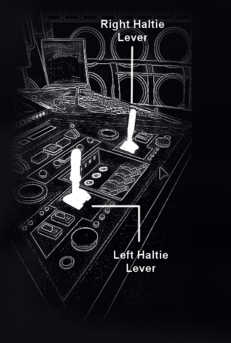
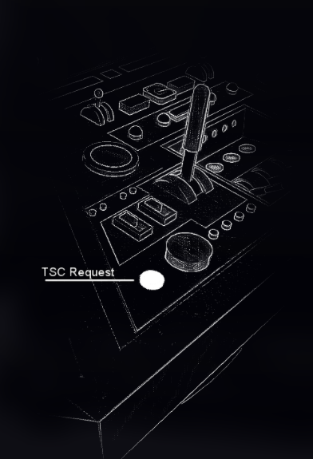

# Advanced Operation

## Reset Switch

This switch will **Deinitialize** your Tardis and **return all the switches to their default position.** This allows you to **recover** a Tardis from a **botched sequence,** if you are **unable to on your own.**


_**Never**_**&#x20;use the Reset Switch** to **simply Deinitialize the Tardis.** Every Reset Switch use _**damages**_**&#x20;the Tardis.**


The Reset Switch has a **300-second inactivity period** during which **it cannot be used.** It **will** also **not respond** if activated while the Tardis is **executing a different function.** The time remaining is shown on the [**Main Display.**](displays.md#main-display)

## Code Pad

### Introduction

The **Code Pad** allows you to **enter specific codes** to **control the lighting** of the Tardis.

### Codes

| Code | Function                                              |
| ---- | ----------------------------------------------------- |
| 001  | Will **lock the** **Code Pad**                        |
| 002  | Will toggle **Rotator lighting.**                     |
| 003  | Will toggle **dimming** for the **Rotator lighting.** |
| 004  | Will toggle **Floor lighting.**                       |
| 005  | Will toggle the Floor lighting's animation            |

## Haltie Levers

### Introduction

These levers serve as brakes. Enabling any of the two will result in a **faster process** of either **Dematerialization** (left lever) or **Materialization** (right lever). Enabling both is recommended, as it will speed up the process of Dematerialization and Materialization.


You can **invert the position** of both levers in one go by [**pushing any of the two into the hinge,**](#user-content-fn-1)[^1] as one would do for a button.


<figure><figcaption>
Both Haltie Levers closeup
</figcaption></figure> <figure><figcaption>
Dematerialize Haltie, Materialize Haltie
</figcaption></figure>

## Tardis Charging

### Manually charging the battery

The Tardis is equipped with a **long-lasting battery.** However, it still needs **recharging** occasionally.

The Tardis uses the **Artron energy** present in the **atmosphere** generated by a **specific crystal** on Artron stars to charg&#x65;**.** This Tardis manual features **one star, Vitality,** that houses these crystals, present in the [**Known Coordinate Listing.**](known-coordinates-listing.md)&#x20;

To recharge the battery, follow **this process:**



You must first **Dematerialize** to travel to the aforementioned known star.&#x20;



You must then input the coordinates in the keypad for the charging planet, Vitality. You may find these in the [**Known Coordinate Listing.**](known-coordinates-listing.md)



The final step is to **materialize,** which will automatically put the Tardis into **charging mode** and **turn it off** by doing so.&#x20;



You must always keep in mind that **attempting to leave without** **stopping** the Tardis **charging** first might result in **unforeseen issues.** Further information in the following section.

Once the Tardis has **finished its charging,** it will **Deinitalize the Tardis and execute a reset,** similar to the [Reset Switch](advanced-operation.md#reset-switch) explained earlier. If you wish to **keep your Tardis Initialized,** **press the TSC Request button** **before reaching 100%** battery level.

### TSC Request Button

If you to your Tardis from charging any further, you must **click on the TSC Request Button,** or Tardis Stop Charge Request button, which **will attempt** a Stop Charge request. This **may not work** at all times, so keep an eye on the **output of the request** on your **Main Display.**


This method _**must**_**&#x20;be used if the Tardis is charging and you wish to use it.** Otherwise, **you risk damaging your Tardis.**


<figure><figcaption>
Tardis Stop Charge (TSC) Request button
</figcaption></figure>

Once the **TSC Request button** **has been pressed,** and the **charging has stopped,** you **may use your Tardis normally.**

### Emergency Recharge Procedure

If the Tardis runs **too low on battery,** it will **automatically** travel to the **nearest Artron star** and **recharge.** This procedure will **begin** **at** **10% remaining battery.**

This process **cannot be stopped,** and it **shouldn't be,** as being **stranded** within your Tardis is a **dangerous situation.**

## Safe-Guard B & A

## Code Pad

## Tooflips

### Crashing your Tardis' software

Enabling **all the Tooflips** will cause the **Main Display's software to crash.** This can be necessary in some cases, but it is **not recommended,** as **t**he crash screen **will collect information** for the crash-log, and this **info gathering will take time.**

[^1]: Right-click any of the two levers.
